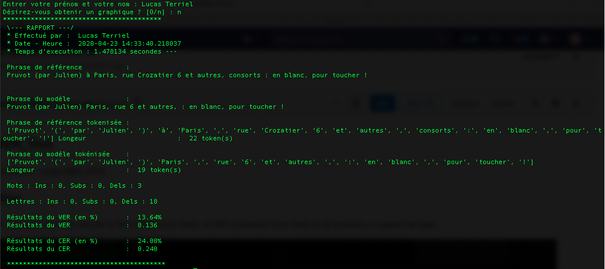
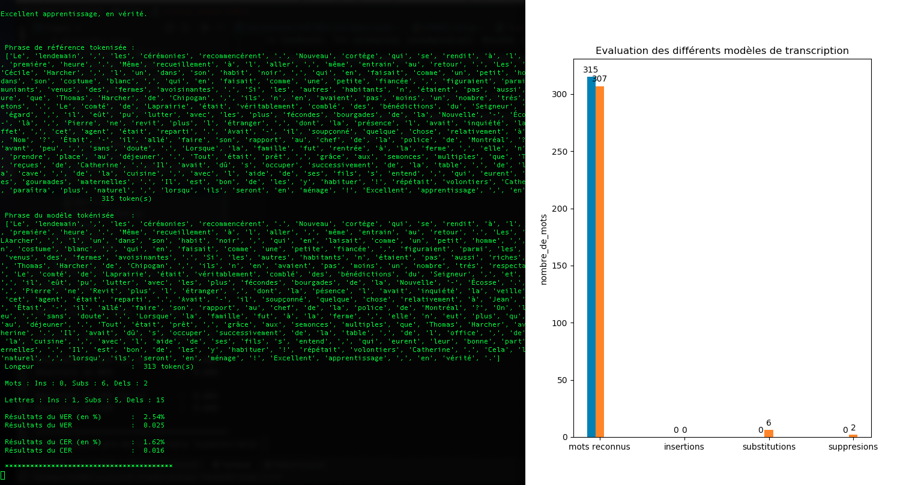

# Documentation cerwer_tool.py

## Description 

Cerwer_tool est un petit programme sous la forme d'un CLI permettant de calculer le WER (Word Error Rate) et le CER (Character Error Rate)
entre phrase de référence (transcription ground truth) et une phrase issue d'un modèle de transcription; et de produire un rapport de type :

Options : 

- Possibilité d'éditer un graphique 
- Possibilité un log dans un fichier .txt

## Utilisation de CER-WER_Tool : 

`$ python cerwer_tool.py [-h] --input REFERENCE_FILE HYPOTHESIS_FILE [--graphique] [--log]  `
